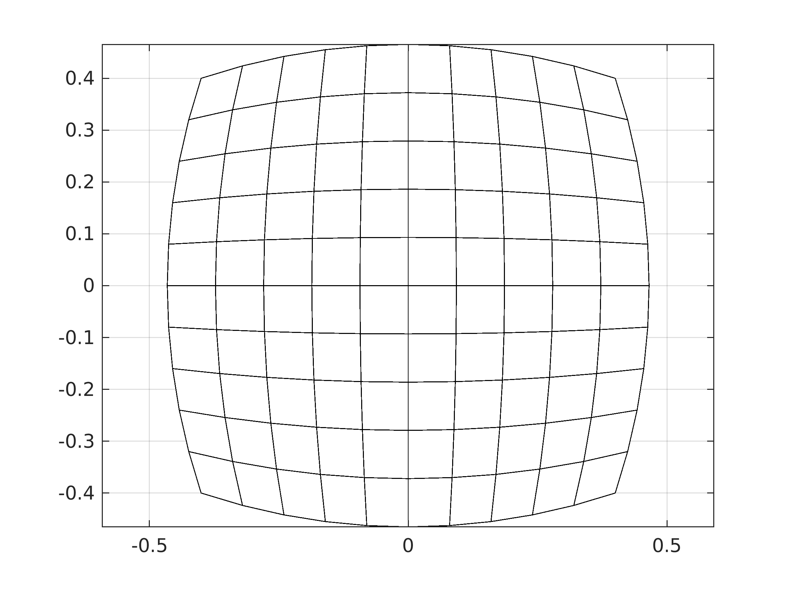
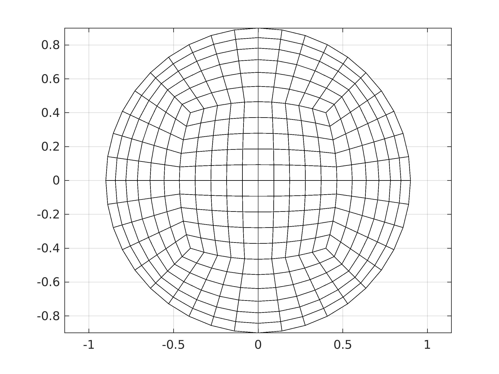
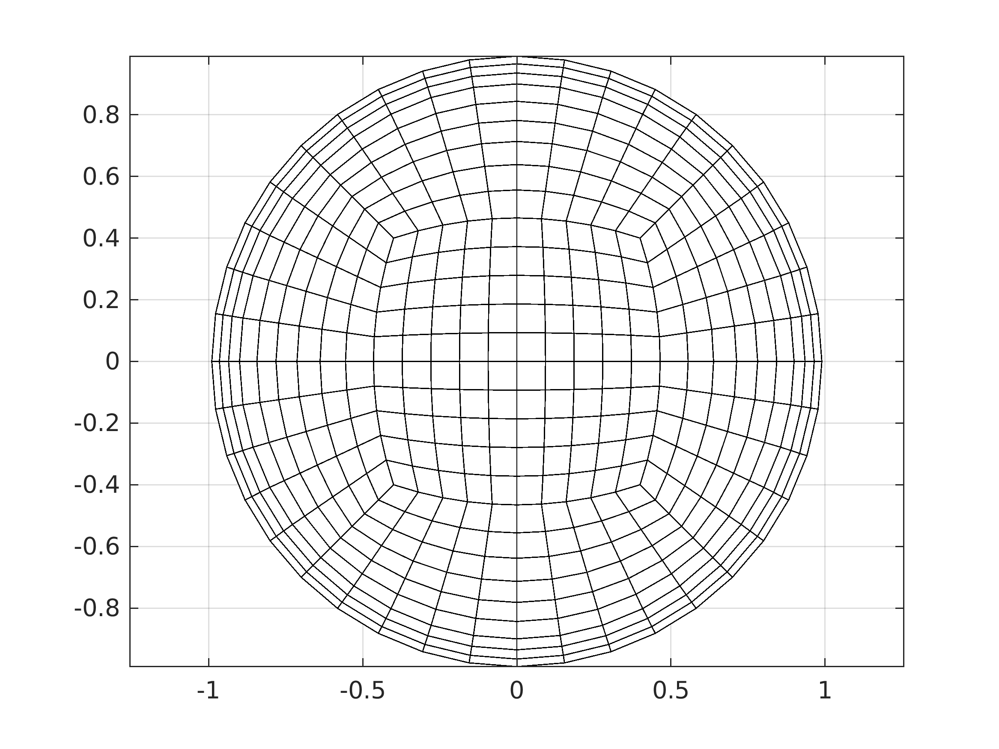
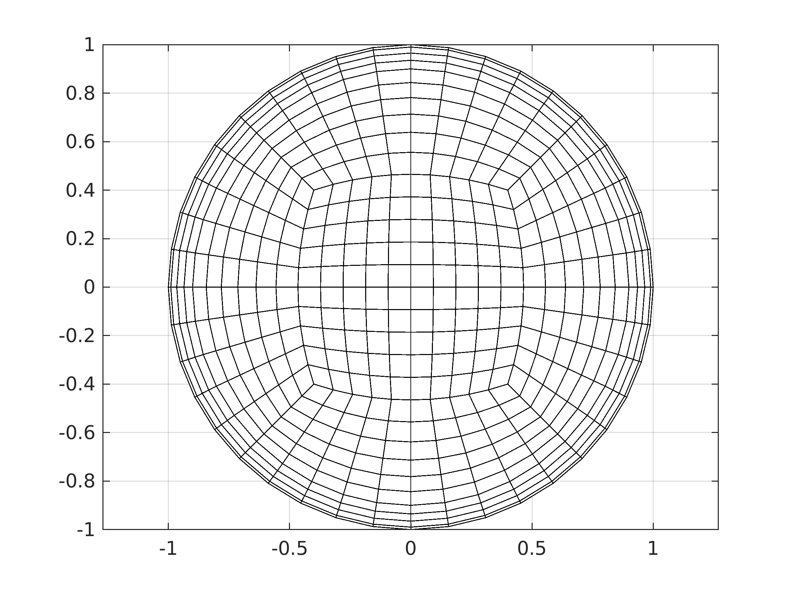
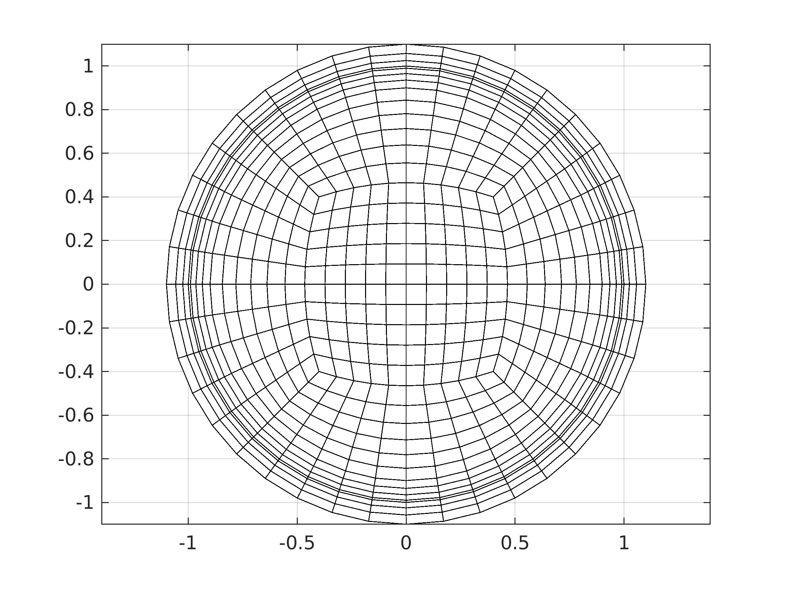
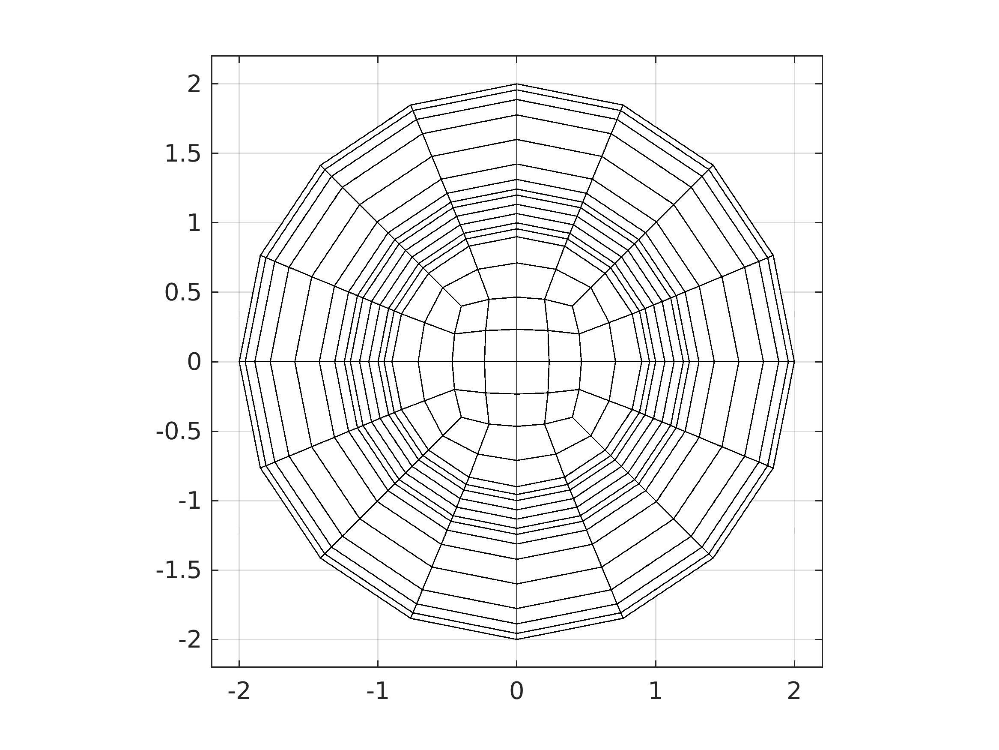
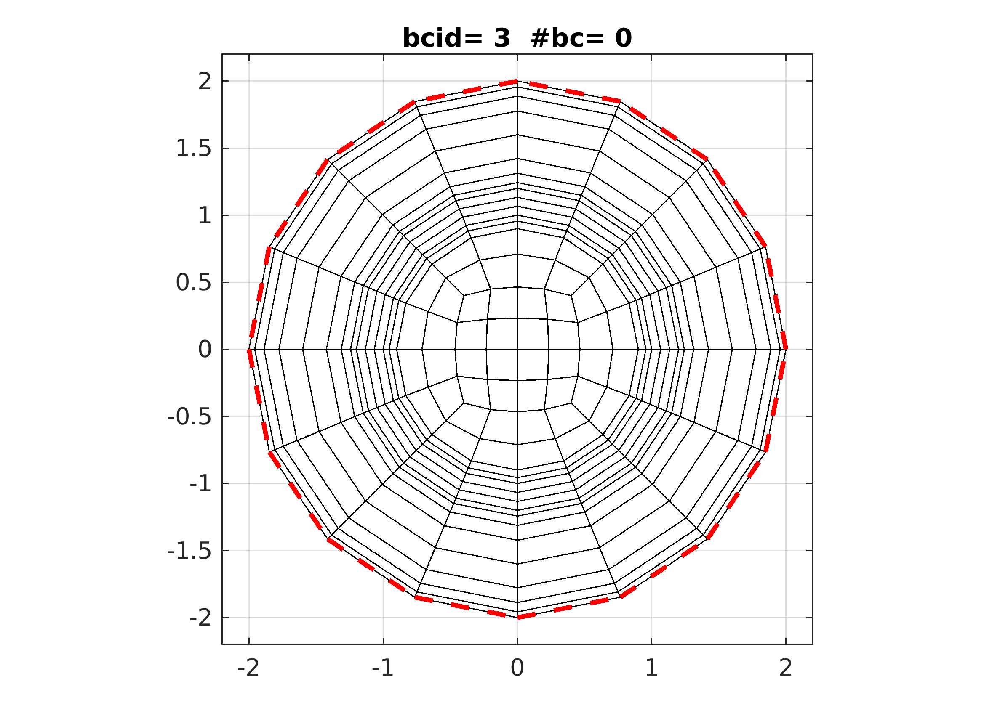

# OneCylinder

Hex mesh generator for a single cylinder for Nek5000 / NekRS

Features:
- Use high-order cylinder curved sides in Nek5000
- Support CHT
- Can be inspected by prex


## Usage:
```
driver_cyl2d
```
| Initial Box, curved | Circle 1 | Curcle 2 | Circle 3 | Solid |
|:---:|:---:|:---:|:---:|:---:|
|  |  |  |  |  |


## corssflow heat exchanger 

Carefully, rearrange the script, we can do cocentric two fluid domain.
The solid elements are order last after the mesh is done. This is very easy in matlab.

```
driver_double_cyl2d.m

r1 = 1
r2 = 1.2
r3 = 2.0

fluid 1: r < r1
solid: r1 < r < r2
fluid 2: r2 < r < r3 
```

| Mesh | Domain | fluid BC | heat BC |
|:---:|:---:|:---:|:---:|
|  |  |  |  |


## TODOS:
- clean up
- argv
- octave
- n2to3
- refactor extrusion, curves and BC
- curves in re2


