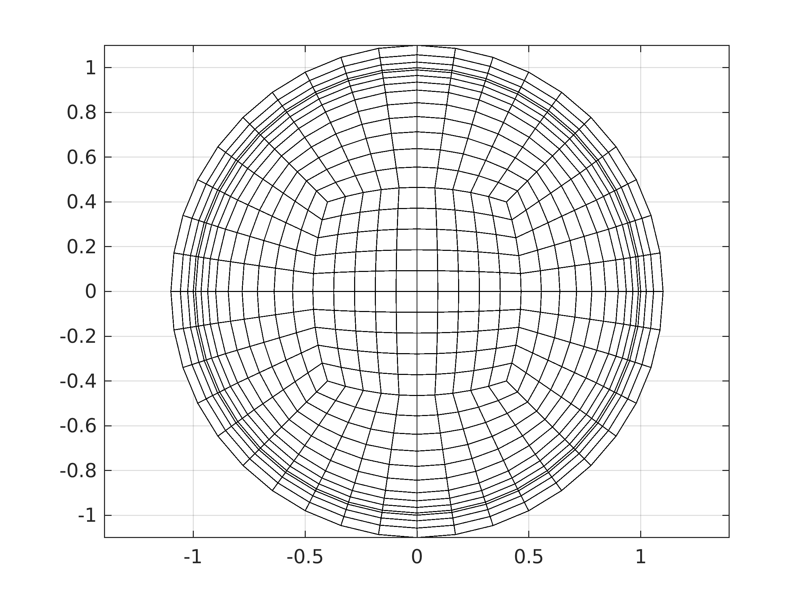

# OneCylinder

Hex mesh generator for a single cylinder for Nek5000 / NekRS

Features:
- Use high-order cylinder curved sides in Nek5000
- Support CHT
- Can be inspected by prex


## Usage:
```
driver_cyl2d
```
| Initial Box, curved | Circle 1 | Curcle 2 | Circle 3 | Solid |
|:---:|:---:|:---:|:---:|:---:|
|  |  |  |  |  |

## TODOS:
- clean up
- argv
- octave
- n2to3
- refactor extrusion, curves and BC
- curves in re2


